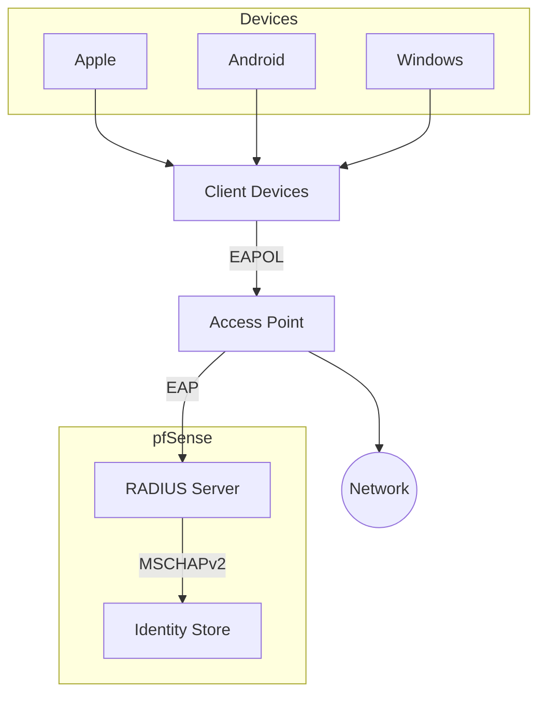

---
tags:
  - daily
created: 2024-09-24 13:44
modified: 2024-09-27T22:46:54+02:00
---
<< [[4 - Kalender/2024/09-September/2024-09-26-Donnerstag|gestern]] | [[4 - Kalender/2024/09-September/2024-09-28-Samstag|morgen]] >>

 [My Tasks](https://calendar.google.com/calendar/u/0/r/tasks)
## ⏰ Time Blocking
- [x] 20:00 - 21:00 Weitz Ma-Vorkurs ✅ 2024-09-30
- [x] 09:00 - 12:00 New item ✅ 2024-09-30
- [x] 12:00 - 16:00 New item ✅ 2024-09-30


## 📝 Notes

![[Pasted image 20240927150322.png]]



---

**Notes created today**
```dataview
List FROM "" WHERE file.cday = date("2024-09-24") SORT file.mtime asc
```

 **Notes last touched today**
 
```dataview
List FROM "" WHERE file.mday = date("2024-09-24") SORT file.mtime asc
```